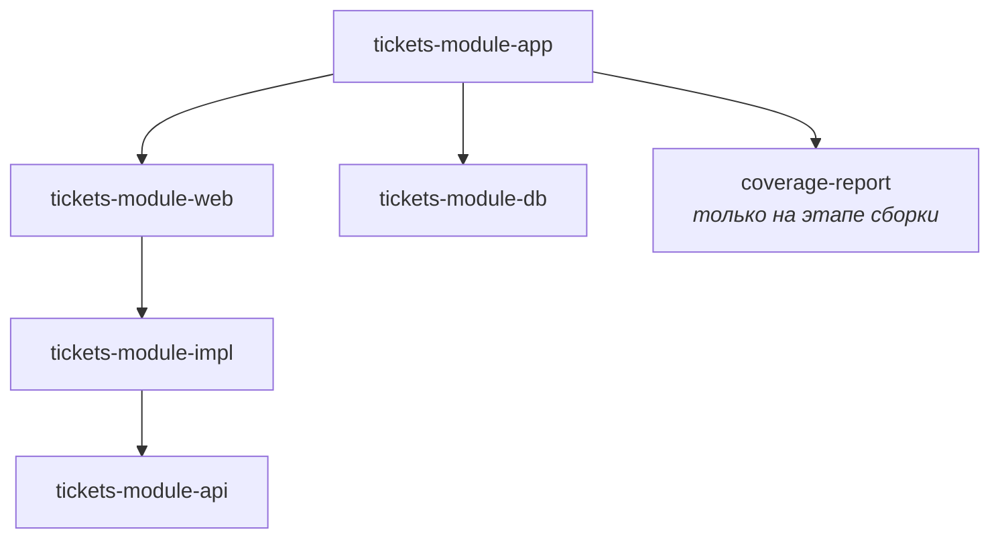

# Tickets-module
Многомодульный Maven-проект для работы с билетами и перевозчиками на Spring Boot.

[](https://sonarcloud.io/dashboard?id=SokolovAndr_tickets-module)
[](https://sonarcloud.io/dashboard?id=SokolovAndr_tickets-module)

## 📋 Описание

Проект представляет собой модульное приложение на Java 17, построенное на Maven и Spring Boot 3.2.5.  
Основная бизнес-логика — управление билетами, маршрутами и перевозчиками.
Дополнительно реализован web-модуль с HTML-формами на Spring MVC + Spring Security.

> 🌐 **Production:** https://tickets-module-production.up.railway.app  
> 📄 **API Documentation (Swagger UI):** https://tickets-module-production.up.railway.app/swagger-ui/index.html

## 📦 Модули проекта

| Модуль | Назначение |
|--------|-----------|
| `coverage-report` | Агрегация отчётов JaCoCo из всех модулей для SonarCloud |
| `tickets-module-app` | Точка входа, конфигурация, интеграционные тесты |
| `tickets-module-web` | Web-слой: HTML-формы, Spring MVC-контроллеры |
| `tickets-module-impl` | Реализация бизнес-логики, UNIT тесты |
| `tickets-module-api` | Контракты REST API: DTO и интерфейсы контроллеров (генерируются из OpenAPI) |
| `tickets-module-db` | Только Liquibase-миграции (XML). Java-кода нет |

### Зависимости между модулями

```mermaid
graph TD
    APP[tickets-module-app] --> WEB[tickets-module-web]
    APP --> DB[tickets-module-db]
    APP --> COV[coverage-report<br/><i>только на этапе сборки</i>]
    WEB --> IMPL[tickets-module-impl]
    IMPL --> API[tickets-module-api]
```

## 🛠 Технологии

| Технология                     | Назначение |
|--------------------------------|-----------|
| ☕ Java 17 + Spring Boot 3.2.5  | Основной язык и фреймворк |
| 🔐 Spring Security 6           | Сессии, JWT |
| 🖼 Thymeleaf                   | Шаблонизатор для web-форм |
| 📦 Maven (wrapper)             | Многомодульная сборка |
| 🐘 PostgreSQL 13               | Основная база данных (через `compose.yaml`) |
| 🧪 JUnit 5 + Mockito + MockMvc | Юнит- и интеграционные тесты |
| 📊 JaCoCo 0.8.11               | Покрытие кода |
| 🔍 SonarCloud                  | Анализ качества и Quality Gate |
| 🐳 Docker Compose              | Локальный запуск БД |
| 📄 OpenAPI Generator           | Генерация DTO и интерфейсов контроллеров |
| 🐳 Dockerfile                  | Сборка образа для деплоя на Railway |
| 🔄 MapStruct 1.5.5             | Генерация мапперов Entity ↔ DTO |

## 🚀 Быстрый старт

### ✅ Требования

| Требование | Версия / Примечание |
|------------|---------------------|
| ☕ JDK | 17+ |
| 📦 Maven | или встроенный `./mvnw` |
| 🐳 Docker + Docker Compose | для запуска БД |

### 📥 Клонирование репозитория

```bash
git clone https://github.com/SokolovAndr/tickets-module.git
cd tickets-module
```

### 🐳 Запуск базы данных

```bash
docker compose up -d
```

### Сборка проекта

```bash
./mvnw clean install
```

### 🔨 Для полной сборки с интеграционными тестами и агрегированным отчётом JaCoCo:

```bash
./mvnw clean verify
```
Агрегированный отчёт будет доступен по пути:
coverage-report/target/site/jacoco/index.html


### ▶️ Запуск приложения

```bash
./mvnw spring-boot:run -pl tickets-module-app
```

### или через собранный JAR:

```bash
java -jar tickets-module-app/target/tickets-module-app-0.0.1-SNAPSHOT.jar
```
Приложение по умолчанию будет доступно на http://localhost:8099.


## ⚙️ Конфигурация

Проект поддерживает профили Spring:

| Профиль | Назначение |
|---------|-----------|
| `application-local.yml` | Локальная конфигурация |
| `application-railway.yml` | Конфигурация для деплоя на [Railway](https://railway.app/) |
| `application-test.yml` | Конфигурация для тестов (H2 in-memory) |

## 🐳 Docker / Railway

Сборка образа:

```bash
docker build -t tickets-module .
```

Dockerfile использует multi-stage build:
1. **build** — `maven:3.9.6-eclipse-temurin-17`, кэширует зависимости (`dependency:go-offline`), собирает JAR.
2. **runtime** — `eclipse-temurin:17-jre-jammy`, запускает `tickets-module-app`.

## 🔐 Безопасность

В проекте используются две независимые цепочки Spring Security:

| Цепочка | Область                               | Механизм                            |
|---------|---------------------------------------|-------------------------------------|
| UI | /login, /register, статические ресурсы | Form login + HTTP-сессия            |
| REST API | /api/**                               | JWT Bearer (OAuth2 Resource Server) |

Для UI-цепочки текущий пользователь резолвится через SessionCurrentUserService, для REST — через JwtCurrentUserService.

## 🧪 Тестирование

| Тип тестов           | Плагин   | Расположение                                             |
|----------------------|----------|----------------------------------------------------------|
| Юнит-тесты           | Surefire | */src/test/java (классы *Test)                           |
| Интеграционные тесты | Failsafe | tickets-module-app/src/test/java, классы с суффиксом *IT |

### Запуск только юнит-тестов:

```bash
./mvnw test
```
### Запуск всех тестов (юнит + интеграционные):

```bash
./mvnw verify
```

## 📊 Покрытие кода

Проект использует агрегированный отчёт JaCoCo — отчёты со всех модулей собираются в coverage-report:
```bash
./mvnw verify
```
SonarCloud использует агрегированный отчёт через параметр:
sonar.coverage.jacoco.aggregateXmlReportPaths=coverage-report/target/site/jacoco/jacoco.xml

## 👤 Автор

**SokolovAndr** — [GitHub](https://github.com/SokolovAndr)

---

> ⚠️ Проект находится в активной разработке. UI, API и структура могут меняться.
